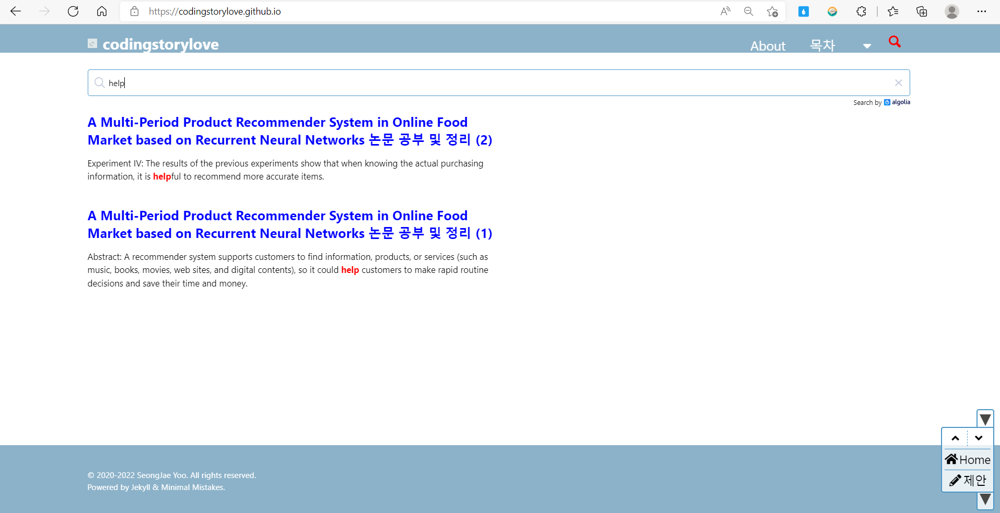

# codingstorylove

[Minimal Mistakes 테마](https://github.com/mmistakes/minimal-mistakes)를 이용한 Github Page.<br/>
이 Blog는 Minimal Mistakes으로부터 시작하여 개발되었습니다.<br/>

Github Page using [Minimal Mistakes Theme](https://github.com/mmistakes/minimal-mistakes).<br/>
This blog is being developed from Minimal Mistakes <br/>

---
search (돋보기 이미지) 기능에 Jekyll Algolia Plugin 적용하였습니다.

0. 설치 참고사이트 - [https://github.com/algolia/jekyll-algolia](https://github.com/algolia/jekyll-algolia)

1. $ bundle exec jekyll algolia

2. Gemfile 수정

gem "jekyll-algolia" 추가해 주었습니다.

3. _config.yml 수정

algolia:
  application_id: 'your_application_id'

- 보안 문제로 저의 application_id는 비공개합니다.

4. ALGOLIA_API_KEY='your_admin_api_key' bundle exec jekyll algolia 터미널에 입력 후 실행 시켰줍니다.




# algolia 검색 엔진은 lunr보다 검색 속도가 빠르나 markdown ```python ``` 코딩소스가 검색이 되지 않아 lunr 검색엔진으로 다시 바꾸었습니다.

## 저장용량 문제로 인해 사진은 깃허브에 올리지 않고 구글 드라이브를 사용해서 링크를 통해 연동해서 사진이 보이게 설정했습니다. 

### Blog URL: [codingstorylove.github.io](https://codingstorylove.github.io/)
